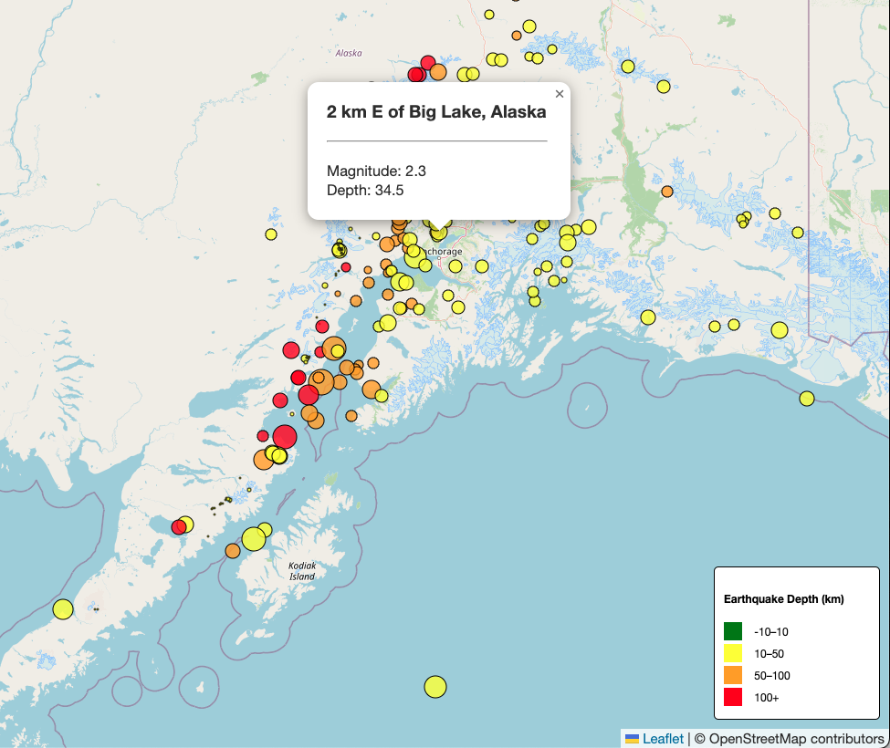

# Earthquake Data Visualization with Leaflet

## Overview

This project involves visualizing earthquake data collected by the United States Geological Survey (USGS) to provide insights into seismic activity around the world. Using **Leaflet.js**, **D3.js**, and **GeoJSON** data, this interactive map allows users to explore earthquake activity based on parameters such as magnitude and depth.

### Key Features:
- **Interactive map** with earthquake data plotted by location, magnitude, and depth.
- **Dynamic color coding** of earthquake markers based on their depth.
- **Popups** displaying relevant earthquake details such as location, magnitude, and depth.
- **Custom legend** that provides context for color and size coding of the markers.
- Option to **toggle layers** and view additional geographic data.

---

## Technologies Used

- **HTML5**
- **CSS3**
- **JavaScript**
- **Leaflet.js** – Interactive map library for building map-based visualizations.
- **D3.js** – Data visualization library for handling and visualizing the GeoJSON data.
- **GeoJSON** – A format for encoding geographic data structures.
  
---

## How It Works

1. **Data Collection**: The project fetches live earthquake data in **GeoJSON** format from the [USGS Earthquake Feed](https://earthquake.usgs.gov/earthquakes/feed/v1.0/summary/significant_week.geojson).
  
2. **Leaflet Map**: A dynamic map is created using **Leaflet.js**, where the earthquake data is plotted by latitude and longitude.

3. **Data Visualization**:
   - **Magnitude**: The size of the marker represents the earthquake’s magnitude.
   - **Depth**: The color of the marker represents the depth of the earthquake (darker colors indicate deeper earthquakes).
   - **Popups**: Each marker shows additional information about the earthquake when clicked, such as magnitude, location, and depth.

4. **Legend**: A custom legend is displayed on the map to explain the color and size coding used for the earthquake markers.

---

## Screenshots

*Screenshot of the interactive earthquake visualization map.*

---

## Future Enhancements (Optional)

- **Layer Controls**: Add the ability to toggle between different data layers, such as tectonic plates or additional seismic data.
- **Time-based Analysis**: Integrate functionality to filter earthquakes by time period (e.g., past day, week, month).
- **Data Analysis**: Perform deeper analysis of earthquake trends over time, regions with the highest activity, or correlations with other environmental factors.

---

## Key Learnings

Through this project, I developed the following skills:

- **GeoJSON** data handling and integration with JavaScript
- **Interactive web maps** using Leaflet.js
- Data visualization techniques with **D3.js**
- Understanding and manipulation of real-time data feeds
- Enhancing the user experience with interactive popups and legends

---

## License

This project is licensed under the MIT License - see the [LICENSE](LICENSE) file for details.

## Acknowledgments

This project was developed with the assistance of **ChatGPT**

